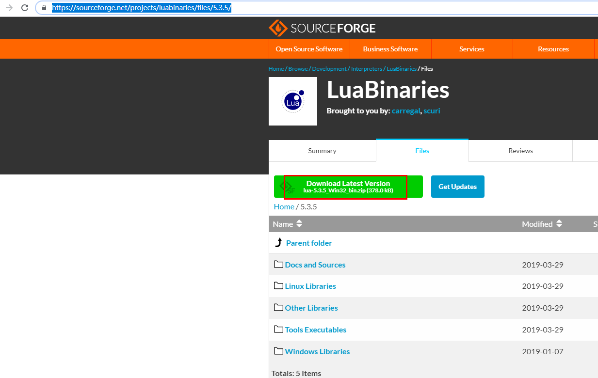
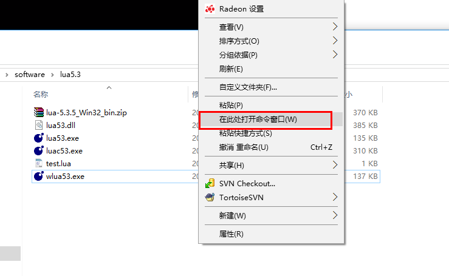

# lua入门

## 1、安装
一、安装windows下的lua环境，luaforwindows

下载最新的5.3版本，下载地址：

https://sourceforge.net/projects/luabinaries/files/5.3.5/

也可以在gitlab下载：

https://github.com/rjpcomputing/luaforwindows/releases



下载解压
lua53.exe就是lua语言解释器
按住shift鼠标右键，此处打开命令窗口


## 2、基本语法

### 注释

单行：  --

多行：  

--[[

 --]]

### 标示符
Lua 标示符用于定义一个变量，函数获取其他用户定义的项。标示符以一个字母 A 到 Z 或 a 到 z 或下划线 _ 开头后加上0个或多个字母，下划线，数字（0到9）。

最好不要使用下划线加大写字母的标示符，因为Lua的保留字也是这样的。

Lua 不允许使用特殊字符如 @, $, 和 % 来定义标示符。 Lua 是一个区分大小写的编程语言。因此在 Lua 中 W3c 与 w3c 是两个不同的标示符。以下列出了一些正确的标示符：

mohd         zara      abc     move_name    a_123
myname50     _temp     j       a23b9        retVal

### 关键词
以下列出了 Lua 的保留关键字。保留关键字不能作为常量或变量或其他用户自定义标示符：

and	break	do	else
elseif	end	false	for
function	if	in	local
nil	not	or	repeat
return	then	true	until
while			
一般约定，以下划线开头连接一串大写字母的名字（比如 _VERSION）被保留用于 Lua 内部全局变量。

### 全局变量
在默认情况下，变量总是认为是全局的。

全局变量不需要声明，给一个变量赋值后即创建了这个全局变量，访问一个没有初始化的全局变量也不会出错，只不过得到的结果是：nil。

```
 print(b)
nil
 b=10
 print(b)
10
```
 
如果你想删除一个全局变量，只需要将变量赋值为nil。

b = nil
print(b)      --> nil
这样变量b就好像从没被使用过一样。换句话说, 当且仅当一个变量不等于nil时，这个变量即存在。

## 3、数据类型
Lua中有8个基本类型分别为：nil、boolean、number、string、userdata、function、thread和table。


|  类型   | 描述  |
|  ----  | ----  |
| nil  | 这个最简单，只有值nil属于该类，表示一个无效值（在条件表达式中相当于false） |
| boolean  | 包含两个值：false和true。 |
| number  | 表示双精度类型的实浮点数。 |
| string  | 字符串由一对双引号或单引号来表示。 |
| function  | 由 C 或 Lua 编写的函数。 |
| userdata	  | 表示任意存储在变量中的C数据结构。 |
| thread  | 表示执行的独立线路，用于执行协同程序。 |
| table  | Lua 中的表（table）其实是一个"关联数组"（associative arrays），数组的索引可以是数字、字符串或表类型。在 Lua 里，table 的创建是通过"构造表达式"来完成，最简单构造表达式是{}，用来创建一个空表。 |

    我们可以使用type函数测试给定变量或者值的类型：
    print(type("Hello world"))      --> string
    print(type(10.4*3))             --> number
    print(type(print))              --> function
    print(type(type))               --> function
    print(type(true))               --> boolean
    print(type(nil))                --> nil
    print(type(type(X)))            --> string

1. nil
   
   nil 类型表示一种没有任何有效值

   对于全局变量和 table，nil 还有一个"删除"作用，给全局变量或者 table 表里的变量赋一个 nil 值，等同于把它们删掉

2. boolean
    
    Lua 把 false 和 nil 看作是"假"，其他的都为"真":

3. number

    Lua 默认只有一种 number 类型 -- double（双精度）类型

4. string

    字符串由一对双引号或单引号来表示。
    
    也可以用 2 个方括号 "[[]]" 来表示"一块"字符串。

    在对一个数字字符串上进行算术操作时，Lua 会尝试将这个数字字符串转成一个数字:

    ```
    > print("2" + 6)
    8.0
    > print("2" + "6")
    8.0
    > print("2 + 6")
    2 + 6
    > print("-2e2" * "6")
    -1200.0
    > print("error" + 1)
    stdin:1: attempt to perform arithmetic on a string value
    stack traceback:
    stdin:1: in main chunk
        [C]: in ?
    >
    ```

    使用 # 来计算字符串的长度，放在字符串前面

    ```
    > len = "www.w3cschool.cn"
    > print(#len)
    ```

5. table

    ```
    -- 创建一个空的 table
    local tbl1 = {}
    
    -- 直接初始表
    local tbl2 = {"apple", "pear", "orange", "grape"}
    ```

    Lua 中的表（table）其实是一个"关联数组"（associative arrays），数组的索引可以是数字或者是字符串。

    ```
    -- table_test.lua 脚本文件
    a = {}
    a["key"] = "value"
    key = 10
    a[key] = 22
    a[key] = a[key] + 11
    for k, v in pairs(a) do
        print(k .. " : " .. v)
    end
    ```
    不同于其他语言的数组把 0 作为数组的初始索引，在 Lua 里表的默认初始索引一般以 1 开始。
    table 不会固定长度大小，有新数据添加时 table 长度会自动增长，没初始的 table 都是 nil。

6. function

    在 Lua 中，函数是被看作是"第一类值（First-Class Value）"，函数可以存在变量里:

7. thread

    在 Lua 里，最主要的线程是协同程序（coroutine）。它跟线程（thread）差不多，拥有自己独立的栈、局部变量和指令指针，可以跟其他协同程序共享全局变量和其他大部分东西。
    线程跟协程的区别：线程可以同时多个运行，而协程任意时刻只能运行一个，并且处于运行状态的协程只有被挂起（suspend）时才会暂停。

8. userdata

    userdata 是一种用户自定义数据，用于表示一种由应用程序或 C/C++ 语言库所创建的类型，可以将任意 C/C++ 的任意数据类型的数据（通常是 struct 和 指针）存储到 Lua 变量中调用。

## 4、变量 

    变量在使用前，必须在代码中进行声明，即创建该变量。编译程序执行代码之前编译器需要知道如何给语句变量开辟存储区，用于存储变量的值。

    Lua 变量有三种类型：全局变量、局部变量、表中的域。

    函数外的变量默认为全局变量，除非用 local 显示声明。函数内变量与函数的参数默认为局部变量。

    局部变量的作用域为从声明位置开始到所在语句块结束（或者是直到下一个同名局部变量的声明）。

    变量的默认值均为 nil。


```
    -- test.lua 文件脚本
    a = 5               -- 全局变量
    local b = 5         -- 局部变量

    function joke()
        c = 5           -- 全局变量
        local d = 6     -- 局部变量
    end

    joke()
    print(c,d)          --> 5 nil

    do 
        local a = 6     -- 局部变量
        b = 6           -- 全局变量
        print(a,b);     --> 6 6
    end

    print(a,b)      --> 5 6
```

赋值语句

    a, b, c = 0, 0, 0

    当变量个数和值的个数不一致时，Lua会一直以变量个数为基础采取以下策略：

    a. 变量个数 > 值的个数             按变量个数补足nil
    b. 变量个数 < 值的个数             多余的值会被忽略 

索引
    对 table 的索引使用方括号 []。Lua 也提供了 . 操作。

    t[i]
    t.i                 -- 当索引为字符串类型时的一种简化写法
    gettable_event(t,i) -- 采用索引访问本质上是一个类似这样的函数调用
    例如：

    > site = {}
    > site["key"] = "www.w3cschool.cn"
    > print(site["key"])
    www.w3cschool.cn
    > print(site.key)
    www.w3cschool.cn

## 5、循环
    1. white

```
while(condition)
do
    statements
end
```

    2. for

数值 for 

var从exp1变化到exp2，每次变化以exp3为步长递增var，并执行一次"执行体"。exp3是可选的，如果不指定，默认为1。

```
for var=exp1,exp2,exp3 do  
    <执行体>  
end  
```

泛型for循环 泛型for循环通过一个迭代器函数来遍历所有值，类似java中的foreach语句。

```
--打印数组 a 的所有值  
for i,v in ipairs(a) 
	do print(v) 
end  
```

    3. repeat...until

```
repeat
   statements
until( condition )
```


## 6、流程控制

```
if( 布尔表达式 1)
then
   --[ 在布尔表达式 1 为 true 时执行该语句块 --]

else if( 布尔表达式 2)
   --[ 在布尔表达式 2 为 true 时执行该语句块 --]

else if( 布尔表达式 3)
   --[ 在布尔表达式 3 为 true 时执行该语句块 --]
else 
   --[ 如果以上布尔表达式都不为 true 则执行该语句块 --]
end
```


## 7、函数 

    1. 定义
```
function max(num1, num2)

   if (num1 > num2) then
      result = num1;
   else
      result = num2;
   end

   return result; 
end
------------------------
myprint = function(param)
   print("这是打印函数 -   ##",param,"##")
end

```


    2. 多返回值

```
function maximum (a)
    local mi = 1             -- 最大值索引
    local m = a[mi]          -- 最大值
    for i,val in ipairs(a) do
       if val > m then
           mi = i
           m = val
       end
    end
    return m, mi
end
```
    3. 可变参数
   
```
function average(...)
   result = 0
   local arg={...}
   for i,v in ipairs(arg) do
      result = result + v
   end
   print("总共传入 " .. #arg .. " 个数")
   return result/#arg
end

print("平均值为",average(10,5,3,4,5,6))
```

## 8、运算法

* 算术运算符
  

* 关系运算符


* 逻辑运算符
  

* 其他运算符

    ".."	连接两个字符串	a..b ，其中 a 为 "Hello " ， b 为 "World", 输出结果为 "Hello World"。
    
    "#" 一元运算符，返回字符串或表的长度。	#"Hello" 返回 5

  运算符优先级
    
    从高到低的顺序：

        ^
        not    - (unary)
        *      /
        +      -
        ..
        <      >      <=     >=     ~=     ==
        and
        or

## 9、字符串

    Lua 语言中字符串可以使用以下三种方式来表示：

    单引号间的一串字符。

    双引号间的一串字符。

    [[和]]间的一串字符。

  1. 字符串操作

    1	string.upper(argument):字符串全部转为大写字母。

    2	string.lower(argument):字符串全部转为小写字母。

    3	string.gsub(mainString,findString,replaceString,num)在字符串中替换,mainString为要替换的字符串， findString 为被替换的字符，replaceString 要替换的字符，num 替换次数（可以忽略，则全部替换），如：
    > string.gsub("aaaa","a","z",3);
    zzza 3

    4	string.find (str, substr, [init, [end]])在一个指定的目标字符串中搜索指定的内容(第三个参数为索引),返回其具体位置。不存在则返回 nil。
    > string.find("Hello Lua user", "Lua", 1) 
    7 9

    5	string.reverse(arg)字符串反转
    > string.reverse("Lua")
    auL

    6	string.format(...)
    返回一个类似printf的格式化字符串
    > string.format("the value is:%d",4)
    the value is:4

    7	string.char(arg) 和 string.byte(arg[,int])
    char 将整型数字转成字符并连接， byte 转换字符为整数值(可以指定某个字符，默认第一个字符)。
    > string.char(97,98,99,100)
    abcd


    string.byte("ABCD",4)
    68
    string.byte("ABCD")
    65


    8	string.len(arg)
    计算字符串长度。
    string.len("abc")
    3

    9	string.rep(string, n))

    返回字符串string的n个拷贝
    > string.rep("abcd",2)
    abcdabcd

    10	..
    链接两个字符串
    > print("www.w3cschool"..".cn")

  1. 字符串大小写转换

    string1 = "Lua";
    print(string.upper(string1))
    print(string.lower(string1))

  2. 字符串查找与反转

    string = "Lua Tutorial"
    -- 查找字符串
    print(string.find(string,"Tutorial"))
    reversedString = string.reverse(string)
    print("新字符串为",reversedString)

  3. 字符串格式化

    string1 = "Lua"
    string2 = "Tutorial"
    number1 = 10
    number2 = 20
    -- 基本字符串格式化
    print(string.format("基本格式化 %s %s",string1,string2))
    -- 日期格式化
    date = 2; month = 1; year = 2014
    print(string.format("日期格式化 %02d/%02d/%03d", date, month, year))
    -- 十进制格式化
    print(string.format("%.4f",1/3))

    基本格式化 Lua Tutorial
    日期格式化 02/01/2014
    0.3333

  4. 字符与整数相互转换

    -- 字符转换
    -- 转换第一个字符
    print(string.byte("Lua"))
    -- 转换第三个字符
    print(string.byte("Lua",3))
    -- 转换末尾第一个字符
    print(string.byte("Lua",-1))
    -- 第二个字符
    print(string.byte("Lua",2))
    -- 转换末尾第二个字符
    print(string.byte("Lua",-2))

    -- 整数 ASCII 码转换为字符
    print(string.char(97))

    76
    97
    97
    117
    117
    a

  5. 其他常用函数

## 10、数组

    1. 一位数组
   
    array = {"Lua", "Tutorial"}

    for i= 0, 2 do
    print(array[i])
    end


    2. 二维数组

    -- 初始化数组
    array = {}
    for i=1,3 do
    array[i] = {}
        for j=1,3 do
            array[i][j] = i*j
        end
    end

    -- 访问数组
    for i=1,3 do
    for j=1,3 do
        print(array[i][j])
    end
    end

## 11、迭代器
## 12、table（表）

    1. table(表)

        table 是 Lua 的一种数据结构用来帮助我们创建不同的数据类型，如：数字、字典等。

        Lua table 使用关联型数组，你可以用任意类型的值来作数组的索引，但这个值不能是 nil。

        Lua table 是不固定大小的，你可以根据自己需要进行扩容。

        Lua也是通过table来解决模块（module）、包（package）和对象（Object）的。        


    2. table(表)的构造

        -- 初始化表
        mytable = {}

        -- 指定值
        mytable[1]= "Lua"

        -- 移除引用
        mytable = nil
        -- lua 垃圾回收会释放内存  

    3. Table 操作

        Table 连接table.concat
            fruits = {"banana","orange","apple"}
            -- 返回 table 连接后的字符串
            print("连接后的字符串 ",table.concat(fruits))

            -- 指定连接字符
            print("连接后的字符串 ",table.concat(fruits,", "))

            -- 指定索引来连接 table
            print("连接后的字符串 ",table.concat(fruits,", ", 2,3))

            连接后的字符串 	bananaorangeapple
            连接后的字符串 	banana, orange, apple
            连接后的字符串 	orange, apple


        插入和移除
            以下实例演示了 table 的插入和移除操作:
            fruits = {"banana","orange","apple"}

            -- 在末尾插入
            table.insert(fruits,"mango")
            print("索引为 4 的元素为 ",fruits[4])

            -- 在索引为 2 的键处插入
            table.insert(fruits,2,"grapes")
            print("索引为 2 的元素为 ",fruits[2])

            print("最后一个元素为 ",fruits[5])
            table.remove(fruits)
            print("移除后最后一个元素为 ",fruits[5])

            索引为 4 的元素为  mango
            索引为 2 的元素为   grapes
            最后一个元素为     mango
            移除后最后一个元素为   nil


        Table 排序

            table.sort(fruits)


## 13、模块和包
## 14、原表（Metatable）
## 15、协同程序
## 16、文件I/O
## 17、对象
## 18、错误处理
## 19、调试
## 20、垃圾回收
